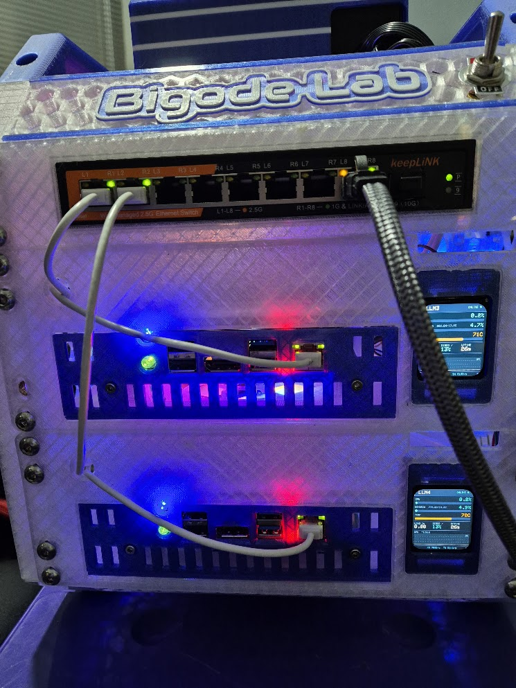
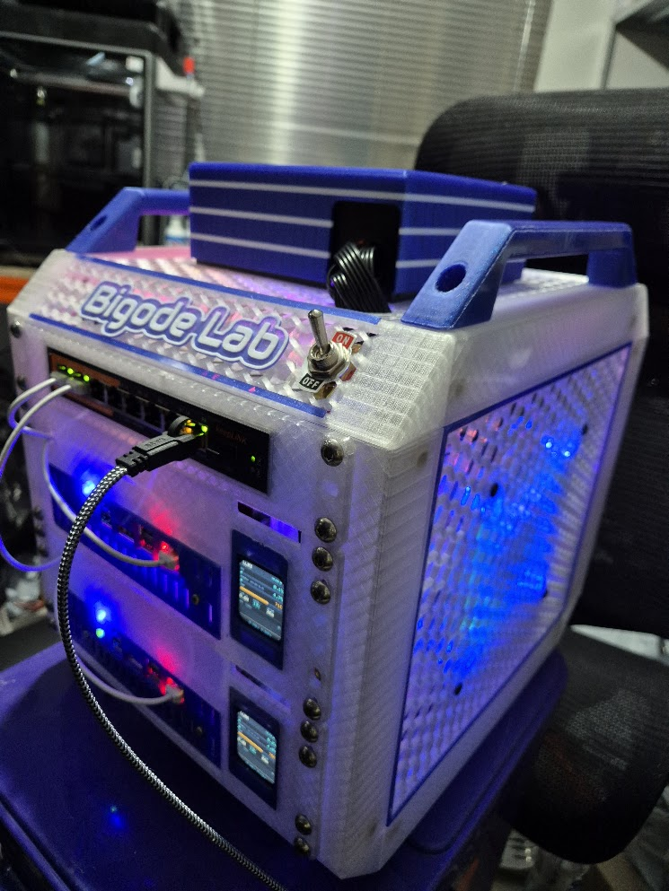

# AMD BC-250 — Setup Guide for Local LLM Inference

Turning an ex-mining **AMD BC-250** board into a working Vulkan inference node
for [`llama.cpp`](https://github.com/ggml-org/llama.cpp), on Ubuntu.

These boards are cheap, plentiful on the secondhand market, and genuinely
capable — but almost nothing about them works out of the box, and most of the
failure modes are *silent*. You end up with a system that runs, reports no
errors, and is quietly a fraction as fast as it should be.

This guide is the write-up of getting several of them working. Every step
explains **why**, because the "why" is what you need when your board behaves
slightly differently from mine.

> **Scope.** Host setup only: firmware, cooling, drivers, memory, clocks, and
> a working `llama.cpp` build. What you serve on top of it is your business.

---

<p align="center">
  
  
</p>

<p align="center">
  <em>Two BC-250 boards in a 3D-printed chassis, each with a status display,
  behind a 2.5G switch. This is what the guide below produces.</em>
</p>

---

## Table of contents

- [What you are working with](#what-you-are-working-with)
- [The four things that will waste your time](#the-four-things-that-will-waste-your-time)
- [Using the scripts](#using-the-scripts)
- [1. BIOS](#1-bios)
- [2. Cooling](#2-cooling)
- [3. Drivers and permissions](#3-drivers-and-permissions)
- [4. Sensors](#4-sensors)
- [5. Memory and GTT](#5-memory-and-gtt)
- [6. Building llama.cpp](#6-building-llamacpp)
- [7. The clock governor](#7-the-clock-governor)
- [8. Unlocking all 40 CUs](#8-unlocking-all-40-cus)
- [9. Thermal tuning](#9-thermal-tuning)
- [10. Running more than one board](#10-running-more-than-one-board)
- [11. Benchmarks — two-board layer split](#11-benchmarks--two-board-layer-split)
- [12. Running it as a service](#12-running-it-as-a-service)
- [Troubleshooting](#troubleshooting)
- [The build](#the-build)
- [Credits](#credits)

---

## What you are working with

The BC-250 is a board pulled from ASRock's BC-250 blockchain/mining systems,
built around a semi-custom AMD APU whose driver-level codename is **Cyan
Skillfish**. It is a compute part with a display-less, headless personality —
which is a large part of why generic AMD GPU guides do not apply cleanly.

| | |
|---|---|
| **PCI ID** | `1002:13fe` |
| **GPU target** | `gfx1013`, driven by **RADV** — Mesa's Vulkan driver |
| **Compute units** | **24 enabled** from the factory; **40 physically present** |
| **Memory** | 16 GB GDDR6, **shared** between CPU and GPU |
| **ROCm support** | None. Vulkan is the only usable acceleration path. |
| **Tested on** | Ubuntu Server 26.04 |

Three consequences worth internalising before you start:

**No ROCm means Vulkan or nothing.** `llama.cpp` with `-DGGML_VULKAN=ON` is the
practical path. Anything in a tutorial that says `rocminfo` or `hipcc` does not
apply to this board.

**Shared memory is not VRAM.** The model lives in system RAM, reached by the
GPU through GTT. How much of it the GPU may address is a kernel setting, not a
hardware limit — and the default silently caps you at roughly half. Section 5.

**It was designed to be loud and disposable.** The stock cooler assumes a
mining chassis with screaming fans and nobody nearby. In a normal room, on
sustained inference load, it thermally throttles. Section 2 is not optional.

---

## The four things that will waste your time

Read these now. Each one costs hours if you meet it without warning, because
none of them produces an error message.

**1. Vulkan silently falls back to CPU.** If your user is not in the `render`
group *in the current login session*, `vulkaninfo` shows only `llvmpipe` — a
software rasterizer. Everything builds, everything runs, inference is orders
of magnitude slower, and nothing anywhere says why. Group membership needs a
**new login session**; reconnect your SSH.

**2. The DRM card index changes between reboots.** Your GPU is `card0` today
and `card1` tomorrow. Every guide that tells you to `cat
/sys/class/drm/card0/device/pp_dpm_sclk` is setting you up to read the wrong
device or get "No such file". Always resolve by PCI device ID:

```bash
for c in /sys/class/drm/card*/device; do
  [ "$(cat $c/device 2>/dev/null)" = "0x13fe" ] && echo "$c"
done
```

**3. A kernel upgrade reverts the 40 CU unlock.** The patched module is built
against the running kernel. After an upgrade you are quietly back to 24 CUs,
with no warning. Re-run the build after upgrades, or pin the kernel.

**4. Short benchmarks lie about thermals.** The heatsink has enough mass to
absorb a two-minute test. The real sustained ceiling only appears after a
10–15 minute heat soak. Tune on short runs and you will ship a board that
throttles in production.

---

## Using the scripts

This repo contains the whole procedure as numbered, idempotent scripts. They
are safe to re-run, none of them reboots your machine on its own, and each one
refuses to proceed if its preconditions are not met.

```bash
git clone https://github.com/wdonega/bc250-llm-setup.git
cd bc250-llm-setup
```

| Script | What it does | Run as | Interrupts |
|---|---|---|---|
| `00-preflight.sh` | Read-only: hardware, IOMMU, idle temps | user | — |
| `10-gpu-drivers.sh` | Mesa/RADV + `render`/`video` groups | `sudo` | **reconnect** |
| `20-sensors.sh` | `lm-sensors` + the Nuvoton chip | `sudo` | — |
| `30-ram-gtt.sh` | Raise TTM page limits via GRUB | `sudo` | **reboot** |
| `40-llama-cpp.sh` | Build with Vulkan + RPC backends | user (**not** sudo) | — |
| `50-governor.sh` | Clock/voltage governor + curve | `sudo` | — |
| `60-unlock-40cu.sh` | Patch amdgpu to expose all 40 CUs | `sudo` | **reboot** |
| `71-configure-worker.sh` | RPC worker as a systemd service | `sudo` | — |
| `72-configure-head.sh` | API server as a systemd service | `sudo` | — |
| `90-validate.sh` | Read-only: verify the whole stack | user | — |

The `7x` pair is only for a **two-board setup**, and they run on different
machines: `71` on the worker, `72` on the head. A single board needs neither.

`_lib.sh` holds shared helpers and is sourced by the others.
Set `ASSUME_YES=1` for unattended runs — but **not** on `60-unlock-40cu.sh`,
which asks you to eyeball the CU map of your specific board first.

**You do not need the scripts.** Every section below contains the manual
commands. The scripts exist to add the checks that are easy to forget by hand.

### Order matters, and not in the obvious way

```
  BIOS ──► cooling ──► drivers ──► sensors ──► GTT ──► llama.cpp ──► governor ──► 40 CU ──► retune
   (1)       (2)         (3)         (4)        (5)        (6)          (7)         (8)       (9)
                          ▲                      ▲                                   ▲         ▲
                          └── reconnect          └── reboot                    reboot ┘         │
                                                                                                │
                             benchmark baseline ─────────────────────────────────────────► compare
```

- **Physical work first.** Nothing downstream is measurable on a board that
  throttles at idle.
- **`llama.cpp` before the CU unlock.** You want a benchmarked baseline before
  you change the silicon's configuration, so that a later problem has one
  candidate cause instead of two.
- **Thermal tuning last, and again after the unlock.** It is the only step that
  must be re-measured on every individual board.

---

## 1. BIOS

Two settings, before you boot anything. Do both in one visit and save a reboot.

- **Disable IOMMU.** A stability requirement on these boards, not a tuning
  preference.
- **Set dedicated VRAM to the minimum (1 GB).** Everything the model needs comes
  through GTT from shared memory anyway; a large carve-out just takes RAM away
  from it.

To confirm IOMMU is really off once you are booted:

```bash
ls /sys/kernel/iommu_groups/ | wc -l    # 0 means disabled
```

---

## 2. Cooling

**Do this before anything else, with the board powered off.** On sustained
inference load the stock cooling is not adequate outside a mining chassis.

There is a trap here worth describing, because it inverts the usual diagnostic.
On one board the dried-out factory paste was *masking* the problem: the
heatsink felt cool to the touch, which looks like good news. It was cool
because the heat was never reaching it. After repasting, the heat arrived —
and the fin stack turned out to be too dense to shed it. **Fixing the paste is
what exposes the airflow problem.** Expect to do both.

1. **Remove the heatsink** — 4 screws in an X pattern around the die.
2. **Repaste.** Factory paste on a refurbished mining board is reliably dried
   out. This is not optional maintenance.
3. **Thin out the central/upper fins.** They are press-fit: pull them **one at
   a time, near the base**. There is a purpose-made printed tool for exactly
   this — [BC-250 Scooper](https://www.printables.com/model/1282906-bc-250-scooper)
   — which grips near the base and spreads the load better than pliers do.
   Needle-nose pliers work too, they are just easier to slip with.
   - ⚠️ **Never with a Dremel, saw, or anything that produces swarf.**
     Aluminium filings on a populated board are a short circuit.
   - ⚠️ **Never with the heatsink still mounted on the board.**
   - If a neighbouring fin bends, straighten it carefully before continuing.
4. **Reassemble** and mount **2x 120 mm fans** blowing down onto the heatsink.

### Verifying

**Target: ~52 °C at idle.** If you are sitting at 70 °C+ doing nothing:

- Are the fans actually spinning?
- Is the airflow pointed *at* the heatsink, not across it?
- **Are they on a 12 V rail?** On 5 V they spin, look fine, and move far too
  little air. This is the most common miss.

> **There is no fan control.** On these boards the fans are wired straight to
> the PSU — no PWM, no software curve, nothing to configure. The governor in
> section 7 controls *clocks*, not airflow. Your only thermal levers are
> physical.

---

## 3. Drivers and permissions

```bash
sudo apt update
sudo apt install -y mesa-vulkan-drivers libvulkan1 libvulkan-dev \
                    vulkan-tools mesa-utils pciutils

sudo usermod -aG render,video "$USER"
```

Or: `sudo ./10-gpu-drivers.sh`

### Now reconnect. Really.

```bash
exit          # then ssh back in
id            # 'render' must appear in the effective groups
```

This is [gotcha #1](#the-four-things-that-will-waste-your-time). `newgrp render`
works in principle but only affects the subshell it spawns, which is exactly
the kind of half-applied state that produces a confusing result an hour later.
Reconnecting is predictable.

### Verify

```bash
vulkaninfo --summary
```

You need to see:

```
deviceName = AMD BC-250 (RADV GFX1013)
driverName = radv
```

- `llvmpipe` appearing **alongside** it is normal and harmless.
- `llvmpipe` as the **only** device means the group is not effective. That is a
  permissions problem, not a driver problem — do not go reinstalling Mesa.
- `DISPLAY` / `DisplayPlaneProperties` warnings are headless-server noise.
  Ignore them.

---

## 4. Sensors

You cannot tune what you cannot measure, and on this board the thermal ceiling
is the real limit — not the frequency cap.

```bash
sudo apt install -y lm-sensors
sudo sensors-detect --auto

# The board's Nuvoton chip needs force=true: the driver refuses to bind
# because it does not recognise this firmware's customer ID. The readings
# it produces once forced are correct.
sudo modprobe nct6683 force=true
echo 'options nct6683 force=true' | sudo tee /etc/modprobe.d/bc250-sensors.conf
echo 'nct6683' | sudo tee /etc/modules-load.d/99-bc250-sensors.conf

sensors
```

Or: `sudo ./20-sensors.sh`

The reading that matters for everything downstream is the `amdgpu` one.

---

## 5. Memory and GTT

With a 1 GB BIOS carve-out, the model lives in system RAM and reaches the GPU
through GTT. The kernel's TTM allocator caps how many pages it will hand out,
and **the default is roughly half your RAM** — a silent ceiling on model size,
well below what the board can actually hold.

Add to `GRUB_CMDLINE_LINUX_DEFAULT` in `/etc/default/grub`:

```
ttm.pages_limit=3670016 ttm.page_pool_size=3670016
```

`3670016 × 4 KiB = 14 GiB`, leaving ~2 GB for the OS on a 16 GB board. Then:

```bash
sudo update-grub
sudo reboot
```

Or: `sudo ./30-ram-gtt.sh` — which parses the existing line instead of
overwriting it, backs it up, and refuses to touch a file with duplicate
`GRUB_CMDLINE_LINUX_DEFAULT` entries.

> ⚠️ **Do not hand-roll this with `sed 's|GRUB_CMDLINE_LINUX_DEFAULT=""|...|'`.**
> It matches only an *empty* value. On a host that already has kernel
> parameters it silently changes nothing and exits successfully, and you reboot
> believing it worked.

Verify after the reboot:

```bash
cat /proc/cmdline | tr ' ' '\n' | grep ttm
cat /sys/class/drm/card*/device/mem_info_gtt_total    # ~14 GiB
```

---

## 6. Building llama.cpp

```bash
sudo apt install -y build-essential cmake git libcurl4-openssl-dev \
                    glslc libvulkan-dev spirv-headers spirv-tools

git clone https://github.com/ggml-org/llama.cpp
cd llama.cpp
cmake -B build -DGGML_VULKAN=ON -DGGML_RPC=ON
cmake --build build --config Release -j"$(nproc)"
```

Or: `./40-llama-cpp.sh` — **as your normal user, not with sudo**, which would
build into `/root`.

**Check `vulkaninfo` shows RADV before you start the build.** Without the render
group effective you will spend ten minutes compiling a perfectly good binary
that then only ever finds `llvmpipe`.

**Why `-DGGML_RPC=ON` even with one board:** it lets this machine act as an
`rpc-server` backend so two boards can split one model by layer (section 10).
Turning it on later means a full rebuild — it costs nothing now.

### Get your baseline number

```bash
./build/bin/llama-bench -hf Qwen/Qwen2.5-0.5B-Instruct-GGUF:Q4_K_M -ngl 999
```

**Write this down.** It is what you compare against after the CU unlock and
after every governor change. Without it you are guessing.

---

## 7. The clock governor

The stock `amdgpu` driver has no usable DPM for this APU — it parks the clock
and leaves it there. [`cyan-skillfish-governor`](https://github.com/filippor/cyan-skillfish-governor)
talks to the SMU directly and gives you a frequency range, a voltage curve, and
a thermal ceiling.

```bash
VER=0.4.12
wget "https://github.com/filippor/cyan-skillfish-governor/releases/download/v${VER}/cyan-skillfish-governor-smu_${VER}-1_amd64.deb"
sudo dpkg -i "cyan-skillfish-governor-smu_${VER}-1_amd64.deb" || sudo apt --fix-broken install -y
sudo systemctl enable --now cyan-skillfish-governor-smu.service
```

Then install a config at `/etc/cyan-skillfish-governor-smu/config.toml`. The
`governor-config.toml` in this repo is a working starting point:

```toml
[frequency-range]
min = 1000    # MHz
max = 1900    # MHz

[temperature]
throttling = 88            # clock down above this
throttling_recovery = 78   # clock back up below this
```

```bash
sudo systemctl restart cyan-skillfish-governor-smu
```

Or: `sudo ./50-governor.sh` — which verifies it is really a BC-250 before
setting any voltages, and backs up your existing config.

> ⚠️ **This sets voltages.** Take the `[[safe-points]]` curve from a known-good
> config rather than inventing values. Undervolting at the top of the curve
> produces silent output corruption, not a clean crash — you get a model that
> works and is subtly wrong.

Two things to understand about the numbers:

- **`max` only governs short bursts.** Under sustained load the thermal ceiling
  decides. A well-cooled 24 CU board settles around 1700 MHz on its own.
  Raising `max` does not raise sustained clocks.
- **The 10 °C gap is hysteresis.** Narrow it and the governor oscillates
  between throttled and unthrottled instead of settling.

---

## 8. Unlocking all 40 CUs

24 of the 40 CUs are fused off *in the driver's view*. They can be re-enabled.
Tooling: [**bc250-40cu-unlock**](https://github.com/wdonega/bc250-40cu-unlock).

### First: look at the harvest map. Do not skip this.

```bash
sudo ./scripts/cu_map.sh
```

| Pattern | Meaning |
|---|---|
| **Contiguous** — `■■■■■■□□□□` in all four shader arrays | Normal factory harvest. Enabling all 40 is safe. |
| **Scattered** — `■■□□■■□□■■` | May be genuinely defective silicon. **Do not blanket-enable.** Run the per-WGP health test from the unlock repo and mask selectively. |

Enabling defective CUs does not get you free performance. It gets you hangs and
corrupt output.

### Then build and enable

```bash
sudo apt install -y gcc make zstd binutils pciutils \
  "linux-headers-$(uname -r)" "linux-source-$(uname -r | cut -d- -f1)"

git clone https://github.com/wdonega/bc250-40cu-unlock.git
cd bc250-40cu-unlock

sudo ./scripts/bc250-enable-40cu.sh build     # 5-15 minutes
modinfo amdgpu | grep -i bc250                # the parm MUST appear here
sudo ./scripts/bc250-enable-40cu.sh enable    # writes modprobe.d + initramfs
sudo reboot
```

Or: `sudo ./60-unlock-40cu.sh` (`--map-only` to just inspect).

**If `modinfo` shows no `bc250` parameter, stop.** The build did not take, and
rebooting will simply give you 24 CUs again while you believe you have 40.

### Verify after the reboot

```bash
sudo dmesg | grep active_cu_number                       # active_cu_number 40
sudo dmesg | grep bc250-40cu                             # CC 0xfff80000->0xffe00000, SPI 0x07->0x1f
RADV_DEBUG=info vulkaninfo --summary 2>&1 | grep num_cu  # num_cu = 40
```

> ### ⚠️ Kernel upgrades revert this
> The patched module is built against the running kernel. After `apt upgrade`
> pulls a new one, you are silently back to 24 CUs. Re-run the `build` step, or
> pin your kernel. `90-validate.sh` in this repo catches it.

---

## 9. Thermal tuning

**Mandatory after the unlock.** 40 CUs draw roughly **125 W** where 24 drew
**95 W** at the same clock. Whatever ceiling you found before no longer holds.

Monitor in one terminal — resolving the card by device ID, per
[gotcha #2](#the-four-things-that-will-waste-your-time):

```bash
CARD=$(for c in /sys/class/drm/card*/device; do \
  [ "$(cat $c/device 2>/dev/null)" = "0x13fe" ] && echo "$c"; done)
watch -n 1 "sensors | grep -A1 amdgpu; echo; cat $CARD/pp_dpm_sclk"
```

Sustained load in another:

```bash
cd ~/llama.cpp
./build/bin/llama-bench -hf Qwen/Qwen2.5-0.5B-Instruct-GGUF:Q4_K_M \
  -ngl 999 -r 50 -p 2048 -n 512
```

**Watch for 10–15 minutes.** What you are looking for is the clock *settling*
at a value and staying there, rather than sawtoothing between throttled and
unthrottled. Sawtoothing means your hysteresis gap is too narrow.

A commonly cited community figure for sustained 40 CU operation is **1500 MHz**,
but treat that as a sanity check on your own measurement, not a target to
configure. Cooling quality varies enormously between boards.

Adjust `[frequency-range]` and `[temperature]`, restart the governor, measure
again.

---

## 10. Running more than one board

Two modes, not mutually exclusive:

**Independent nodes** — best for throughput. Each board runs its own
`llama-server`; put them behind whatever OpenAI-compatible router you already
use and let it load-balance.

**Layer split** — for a model larger than one board's memory:

```bash
# on the worker
./build/bin/rpc-server -H 0.0.0.0 -p 50052

# on the head node
./build/bin/llama-server -m model.gguf --rpc <worker-ip>:50052 -ngl 999
```

This is what `-DGGML_RPC=ON` in section 6 was for.
[Section 11](#11-benchmarks--two-board-layer-split) has measured numbers for
the layer-split mode, including how it compares against a single board.

---

## 11. Benchmarks — two-board layer split

Measured 2026-09-14 with `llama.cpp` (Vulkan + RPC), model
`unsloth/Qwen3.8-27B-GGUF`, both boards with the 40 CU unlock applied and the
governor at max 1900 MHz / 88 °C.

| | Head node | Worker node |
|---|---|---|
| Role | `llama-server` | `ggml-rpc-server -c` |
| RAM | 14693 MB | 14694 MB |
| GTT | 14 GiB (`ttm.pages_limit=3670016`) | 14 GiB |

Interconnect: 2.5 GbE.

### Method

The same Java code-review prompt on every run — 875 tokens in (833 on the
Q4/32k run), a fixed 3000 tokens out, `-ngl 999 --parallel 1 --no-mmproj`, and
KV cache at `q8_0` except where noted.

Two generation figures are reported, because they differ and the gap is the
interesting part. **Average** is `eval time` over the full 3000 tokens.
**First 100** is the instantaneous rate at token 100 — it always starts higher
and decays as the context fills.

### Results

| Config | Prompt eval | Gen (avg) | Gen (first 100) | Total | Free RAM on head |
|---|---|---|---|---|---|
| **Q4_K_M, 32k ctx** (split) | 72.6 t/s | **16.18 t/s** | 17.75 t/s | 3m17s | **4.3 GB** |
| Q4_K_M, 64k ctx (split) | 75.8 t/s | 15.55 t/s | 17.42 t/s | 3m24s | 3.2 GB |
| Q5_K_XL, 32k ctx (split) | 72.6 t/s | 13.41 t/s | 15.03 t/s | 3m56s | 2.0 GB |
| Q5_K_XL, 64k ctx, KV q8 (split) | 71.5 t/s | 13.23 t/s | 15.05 t/s | 3m59s | 0.9 GB |
| Q5_K_XL, 64k ctx, KV q4 (split) | 71.0 t/s | 13.80 t/s | 15.25 t/s | 3m50s | 1.4 GB |
| Q3_K_XL, 8k ctx (**single node**) | **80.9 t/s** | 14.65 t/s | **18.96 t/s** | 3m35s | 0.9 GB |

GTT used across the split:

| Config | Head | Worker | Total |
|---|---|---|---|
| Q4_K_M, 32k | 8.9 GiB | 7.2 GiB | 16.1 GiB |
| Q5_K_XL, 32k | 11.2 GiB | ~8.9 GiB | ~20 GiB |

The head always holds more: on top of its share of layers it carries the KV
cache and the context buffers.

### What the numbers show

**Quantisation dominates; context size barely registers.** Doubling 32k → 64k
cost 3.9 % on Q4 and 1.3 % on Q5. Going Q4 → Q5 cost 17 %. That holds while the
context is empty — the real decay shows up as it fills.

**The network is not the bottleneck people expect.** This was the open question
when the build went up, and the answer is: at 2.5 GbE, with a 27B model split
by layer, the RPC round-trip is not what limits you. The quant is.

**Prompt eval scales with prompt size.** Early runs with 66-token prompts
managed 16–21 t/s. At 875 tokens it is 71–81 t/s. The per-round-trip overhead
dilutes when there is more to process per trip, so short prompts make the
split look far worse than it is.

**KV cache at `q4_0` is nearly free.** 4 % faster (less data over the wire) and
~400 MB back. Less than hoped, because with an empty context the cache is not
populated yet — the saving grows in real use.

**Splitting solved a memory problem without costing speed.** Note what the
single-node row is and is not. It is **not** apples-to-apples, and is not meant
to be: Q3_K_XL at 8k is roughly the largest this model gets on one board, and
that board ends up with 0.9 GB free. So the comparison it supports is the one
that actually matters — *split with the quant you want* versus *single node
with the quant that fits*. On that comparison the split wins on both axes: a
better quant, 4.3 GB of headroom, and a higher average generation rate.

Single node still wins where the network is genuinely absent: best prompt eval
(80.9 t/s) and the fastest first 100 tokens (18.96 t/s). It just cannot hold
the configuration you want to run.

### The operational choice

The two candidates worth running are **Q4_K_M + 64k** (fastest, 3.2 GB free)
and **Q5_K_XL + 32k** (better quant, 2.0 GB free).

Anything under ~1.5 GB free on the head — Q5 + 64k, and the single-node Q3 —
runs, but is not *operable*: a full context or one extra process on the box
puts `llama-server` in front of the OOM killer.

Choosing between the two is not a benchmark question. It comes down to answer
quality on real code, which none of this measures. The signal to watch for is
API hallucination — a method or annotation that does not exist in the library.

---

## 12. Running it as a service

Everything so far has been run by hand. To make it survive a reboot there are
two systemd units, one per board.

```bash
# on the WORKER board, first
sudo ./71-configure-worker.sh

# on the HEAD board
sudo ./72-configure-head.sh
```

Worker first. The head retries every 15s so the reverse order converges too —
it just wastes a few minutes in restart loops.

Both units are **templates**: `__USER__` and `__HOME__` are substituted at
install time from the account you sudo from, so nothing is pinned to my
username. Don't install the `.service` files by hand — the scripts render
them, check that the binaries exist, that the `render`/`video` groups exist,
and that the board really is a BC-250 before touching systemd.

### What the units do beyond starting a process

| Setting | Why |
|---|---|
| `OOMScoreAdjust=-500` | With ~3 GB free the server is the box's largest process and the OOM killer's natural first pick. This makes the kernel take something else. |
| `TimeoutStartSec=900` | First load pushes half the tensors over the network — minutes, not seconds. The default timeout would kill it mid-load. |
| `Restart=always` + `RestartSec=15` | Covers the worker not being up yet, with no cross-host dependency to declare. |
| `ProtectSystem=strict`, `ProtectHome=read-only` | Confines the process; `ReadWritePaths` opens only the two cache directories it actually writes. |
| `DeviceAllow=/dev/dri rw`, `SupplementaryGroups=render video` | Without both, the hardening above takes the GPU away and you are silently back on llvmpipe. |
| `--cache` on the worker | Local tensor cache, so the head doesn't re-send the model on every restart. |

### Tuning without editing the unit

Model, context size, KV cache type and worker address live in
`/etc/default/llama-server`:

```bash
sudoedit /etc/default/llama-server
sudo systemctl restart llama-server
```

`72-configure-head.sh` installs that file **once** and never overwrites it, so
a re-run can't silently change what you're serving. Its comments carry the
measured combinations from
[section 11](#11-benchmarks--two-board-layer-split) next to their memory
headroom — which is the number that decides whether a config is operable, not
the throughput.

### ⚠️ The RPC port is not safe to expose

llama.cpp's RPC protocol has **no authentication and no input validation**.
Anything that can reach port 50052 can execute code on the worker. The unit
sets `IPAddressAllow` to the RFC1918 ranges as a backstop, but treat that as
defence in depth, not as permission to route the port somewhere.

The API on `:8080` binds to `0.0.0.0` so other machines can use it. Put it
behind whatever you normally use for that, and keep it off the internet.

---

## Troubleshooting

If you cloned this repo, `./90-validate.sh` checks everything below in one pass
and exits with the number of failures.

| Symptom | Likely cause |
|---|---|
| `vulkaninfo` shows only `llvmpipe` | `render` group not effective in this session — **reconnect** |
| Inference works but is absurdly slow | Same thing. Almost always this. |
| `pp_dpm_sclk`: No such file | Card index changed on reboot — resolve by device ID `0x13fe` |
| Clock stuck low, never recovers | Thermal throttle; `throttling_recovery` gap too narrow |
| Clock sawtooths under load | Hysteresis gap too narrow — widen it |
| 70 °C+ at idle | Paste, heatsink contact, or airflow. Check the fans are on **12 V** |
| Governor will not exceed ~1500 MHz | `[frequency-range] max` is below the next DPM step |
| `num_cu` back to 24 after an upgrade | Kernel upgrade reverted the unlock — rebuild |
| GTT far smaller than 14 GiB | `ttm.*` missing from `/proc/cmdline`, or no reboot yet |
| Random hangs / corrupt output after unlock | Possibly defective CUs — re-check the harvest map |
| Instability under load, no thermal cause | IOMMU still enabled in the BIOS |
| `llama-server` restart-loops every 15s | Worker not up — run `71-configure-worker.sh` on the other board |
| Service dies with `203/EXEC` | Built without `-DGGML_RPC=ON`, so there is no `ggml-rpc-server` binary |
| Service runs but inference is slow | Hardening took the GPU — check `DeviceAllow` / `SupplementaryGroups` survived your edits |
| `llama-server` OOM-killed on long runs | Under ~1.5 GB free. Drop the quant or the context |

---

## The build

### Hardware

| Item | Used here | Notes |
|---|---|---|
| **Boards** | 2x AMD BC-250 | Section 10 covers running them together |
| **PSU** | MSI 650 W (ATX) | See below |
| **Switch** | KeepLiNK managed 2.5G — 8x 2.5 GbE + 1x 10G SFP+ | See below |
| **Fans** | 2x 120 mm per board | Wired straight to the PSU — [section 2](#2-cooling) |

**On the PSU.** 650 W is comfortable headroom, not a requirement: two boards
draw roughly 125 W each with all 40 CUs active (95 W at 24), so the compute
load is around 250 W. Size for the boards you plan to add, and remember the
fans hang off the same supply — there is no PWM header, they run straight off
a 12 V rail.

**On the switch.** In the layer-split mode of
[section 10](#10-running-more-than-one-board) activations cross the network
between boards on every token, so it is fair to assume the link matters.
[Section 11](#11-benchmarks--two-board-layer-split) measures it, and the answer
is that at 2.5 GbE it is **not** the bottleneck for a 27B model — the
quantisation is. Worth knowing before you spend money on faster networking to
fix a problem you do not have. The 10G SFP+ port here is the uplink to the rest
of the network, not something the boards themselves need.

### Printed parts

The chassis in the photos is 3D printed. **[`models.3mf`](models.3mf)** in this
repo is the full project as sliced — 14 plates, Creality Print — containing
every part used:

| Part | Purpose |
|---|---|
| `10InchRackGenerator.stl`, `Rack Edge`, `Top Front Edge`, `Left Handle`, `Right Front Foot` | The 5U 10-inch rack frame |
| `atx top support`, `laterais maiores`, `borda` | Board support and side panels |
| `honeycomb_plate.stl`, `honeycomb_plate_fanmount.stl` | Honeycomb side panel and its fan mount |
| `capa fonte` | PSU cover |
| `io-shield.stl` | I/O shield |
| `tampa lcd` | Covers for the two status displays |

### Source models

These are other people's designs. Follow the links — each remains under its
author's own license and terms.

| Model | Author's page | Used |
|---|---|---|
| **Mini Lab RAX 5 — 5U server rack** | [MakerWorld](https://makerworld.com/en/models/2499872-mini-lab-rax-5-server-rack-5u#profileId-2748006) | **Adapted** — the rack was modified to fit this build |
| **BC-250 to ATX case adapter** (board mount + front panel) | [Printables](https://www.printables.com/model/1743485-bc250-to-atx-case-adapter) | Unmodified |
| **2HE 10-inch rack mount for mini-ITX / ATX PSU** (hangs the mount in the rack) | [MakerWorld](https://makerworld.com/en/models/1360827-2he-10-inch-rack-mount-mini-itx-atx-psu#profileId-1405438) | Unmodified |
| **BC-250 Scooper** (tool for removing heatsink fins) | [Printables](https://www.printables.com/model/1282906-bc-250-scooper) | Unmodified — see [section 2](#2-cooling) |

The scooper is a *tool*, not a chassis part — it is not in `models.3mf`, print
it separately from the link above.

---

## Credits

This guide stands on other people's work:

- **[filippor/cyan-skillfish-governor](https://github.com/filippor/cyan-skillfish-governor)**
  — the SMU governor that makes these boards usable at all.
- **[ggml-org/llama.cpp](https://github.com/ggml-org/llama.cpp)** — the Vulkan
  backend that makes them useful.
- **[bc250-40cu-unlock](https://github.com/wdonega/bc250-40cu-unlock)** — the
  CU unlock tooling.
- The wider BC-250 community, whose scattered forum posts and Discord messages
  are where most of this was originally worked out.

---

## License

[AGPL-3.0](LICENSE).

---

## A note on what is and is not verified here

Everything in this guide was run on real hardware. But **boards vary** —
different refurbishers, different thermal history, different silicon quality.
Specifically:

- The **thermal numbers are from my boards.** Yours will differ. Measure.
- The **voltage curve** is a working starting point, not a universal safe
  setting.
- The **CU unlock** modifies a kernel module and re-enables silicon the vendor
  disabled. It has been stable here. It is still your hardware and your risk.

Corrections and additions from other people's boards are very welcome — that is
how the numbers in here get better.
